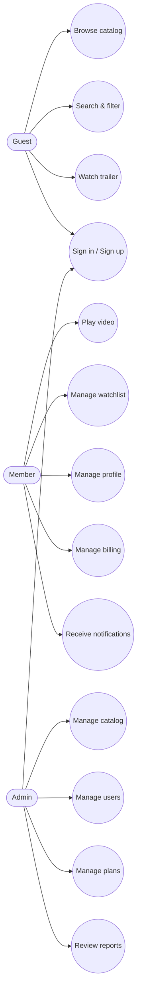

<div align="center">
  <h1>CineInSal</h1>
  <p>Platform streaming edukasi dan hiburan dengan UI modern, responsif, dan fokus pada pengalaman pengguna.</p>
  
  <p>
    
    
    
    
    
    
  </p>
  <p>
    
    
    
    
  </p>
</div>


## Table of Contents
- Overview
- Highlights
- Tech Stack
- Motion and Visuals
- UML Diagrams
- Project Structure
- Getting Started
- Scripts
- Data and Docs

## Overview
CineInSal adalah aplikasi web streaming untuk konten edukasi dan hiburan. Fokus utamanya adalah pengalaman menonton yang halus, navigasi cepat, dan desain UI modern yang konsisten di desktop maupun mobile.

## Highlights
-  Auth lengkap: login, register, dan role admin.
-  Explore dengan pencarian, filter, dan kategori konten.
-  Pemutar video dengan tab deskripsi, episode, dan catatan.
-  Watchlist dan riwayat tontonan.
-  Admin dashboard untuk kelola konten dan pengguna.
-  i18n berbasis JSON dan data mock untuk pengembangan cepat.
-  Analitik dan chart untuk insight konten.

## Tech Stack
| Layer | Tools | Notes |
| --- | --- | --- |
| Frontend | React 18, React Router | SPA cepat dan modular |
| Styling | Tailwind CSS, MUI | Utility-first dan komponen kompleks |
| State | Zustand, Context | State global ringan |
| Data | Axios, mock JSON | API mock untuk dev |
| i18n | i18next | Multi bahasa |
| Charts | Chart.js, Recharts | Visualisasi data |
| Testing | Jest, Testing Library | Unit dan UI test |
| Motion | Framer Motion | Animasi transisi dan interaksi |

## Motion and Visuals
Animasi diprioritaskan untuk memberikan rasa hidup pada UI, transisi halaman, dan feedback interaksi.


## UML Diagrams
Sumber UML non-sensitive ada di `uml/` dan cuplikan berikut memakai format Mermaid agar mudah dibaca di README.

<details>
<summary>Use Case Diagram - Roles and Actions</summary>

Source: `uml/usecase-platform.mmd`


</details>

<details>
<summary>Activity Diagram - Main User Flow</summary>

Source: `uml/activity-main.mmd`


</details>

<details>
<summary>Sequence Diagram - Login dan Playback</summary>

Source: `uml/sequence-playback.mmd`


</details>

<details>
<summary>Class Diagram - Core Domain</summary>

Source: `uml/class-core.mmd`


</details>

## Project Structure
```text
.
├─ docs/
│  ├─ animations/
│  └─ uml-viewer.html
├─ public/
├─ src/
│  ├─ assets/
│  ├─ components/
│  ├─ hooks/
│  ├─ layouts/
│  ├─ mocks/
│  ├─ pages/
│  ├─ routes/
│  ├─ services/
│  ├─ store/
│  └─ utils/
├─ uml/
└─ package.json
```

## Getting Started
### Prerequisites
- Node.js v18+
- npm / yarn / pnpm

### Install
```bash
npm install
```

### Run Dev Server
```bash
npm run dev
```

### Build
```bash
npm run build
```

### Test
```bash
npm run test
```

## Scripts
- `npm run dev` - start dev server
- `npm run build` - production build
- `npm run preview` - preview build
- `npm run lint` - lint code
- `npm run test` - run tests

## Data and Docs
- Mock data ada di `src/mocks/` untuk simulasi API.
- UML tambahan dan PlantUML lain ada di `docs/`.
- UML Mermaid yang non-sensitive ada di `uml/`.
<div align="center">
  
</div>
